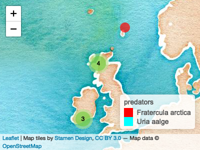

<!-- README.md is generated from README.Rmd. Please edit that file -->

# seabirddietDB

<!-- badges: start -->

[](https://travis-ci.org/annakrystalli/seabirddietDB)
[](https://codecov.io/gh/annakrystalli/seabirddietDB?branch=master)
<!-- badges: end -->

The goal of seabirddietDB is to provide access and tools to interact
with a database of seabird diets collected around the British Isles.

## Installation

You can install the development version from
[GitHub](https://github.com/) with:

``` r
# install.packages("remotes")
remotes::install_github("annakrystalli/seabirddietDB")
```

## Data

For more details on the dataset, check out the [full
documentation](https://annakrystalli.me/seabirddietDB/)

## Example

To access the data simply load the package. The data is then available

``` r
library(seabirddietDB)
```

``` r
seabirddiet
```

    #> # A tibble: 2,857 x 33
    #>       id  year startyear endyear multiyear location latitude longitude
    #>    <int> <dbl>     <dbl>   <dbl> <lgl>     <chr>       <dbl>     <dbl>
    #>  1     1  1973      1973    1973 FALSE     Co. Ker…     52.2     -9.75
    #>  2     2  1973      1973    1973 FALSE     Co. Ker…     52.2     -9.75
    #>  3     3  1973      1973    1973 FALSE     Co. Ker…     52.2     -9.75
    #>  4     4  1973      1973    1973 FALSE     Co. Ker…     52.2     -9.75
    #>  5     5  1973      1973    1973 FALSE     Co. Ker…     52.2     -9.75
    #>  6     6  1973      1973    1973 FALSE     Co. Ker…     52.2     -9.75
    #>  7     7  1973      1973    1973 FALSE     Co. Ker…     52.2     -9.75
    #>  8     8  1983      1983    1983 FALSE     East An…     52.5      1   
    #>  9     9  1983      1983    1983 FALSE     East An…     52.5      1   
    #> 10    10  1983      1983    1983 FALSE     East An…     52.5      1   
    #> # … with 2,847 more rows, and 25 more variables: pred_common_name <chr>,
    #> #   pred_species <chr>, pred_rank <chr>, pred_aphia_id <int>,
    #> #   pred_valid_name <chr>, pred_valid_aphia_id <int>,
    #> #   pred_breeding_status <chr>, pred_age_group <chr>,
    #> #   prey_orig_descr <chr>, prey_taxon <chr>, prey_rank <chr>,
    #> #   prey_aphia_id <int>, prey_valid_name <chr>, prey_valid_aphia_id <int>,
    #> #   prey_size <chr>, prey_age_group <chr>, freq_occ <dbl>, freq_num <dbl>,
    #> #   freq_biomass <dbl>, sample_size <dbl>, sample_type <chr>, ref_n <dbl>,
    #> #   ref_ids <chr>, source <chr>, notes <chr>

A version with more formal data types/structures in the columns (ie
geographic information stored as `sf`, categorical data as factors etc)
is also available. Note that you will need package `sf` installed to
load this version of the data.

``` r
class(seabirddiet_)
```

## Helpers

### metadata

A number of metadata datasets are included with the package:
`attributes`, `references` and `classification`. Load them as you would
one of the datasets, e.g. :

``` r
references
#> # A tibble: 97 x 2
#>    ref_id ref_valid                                                      
#>    <chr>  <chr>                                                          
#>  1 REF001 Anderson et al 2014 Ibis 156, 23-34                            
#>  2 REF002 Bailey et al 1991 ICES Mar. Sci. Symp., 193, 209-216           
#>  3 REF003 Baker et 1999 JNCC Report 289, 1-51                            
#>  4 REF004 Blake BF 1984 J. Experimental. Mar.Biol. Ecol. 76, 89-103      
#>  5 REF005 Blake et al 1955 Estuarine, Coastal & Shelf Science 20, 559-568
#>  6 REF006 Blake et al 1980 Unpubl NCC Report                             
#>  7 REF007 Blake et al 1985 Estuarine, Coastal & Shelf Science 20, 559-568
#>  8 REF008 Bull  et al 2001 JNCC Report, No. 303                          
#>  9 REF009 Bull  et al 2001 JNCC Report, No. 315                          
#> 10 REF010 Bull et al 2004 Ardea 92, 43-52                                
#> # … with 87 more rows
```

### List

List predators

``` r
sbd_predators()
#> [1] "Alca torda"                "Fratercula arctica"       
#> [3] "Fulmarus glacialis"        "Morus bassanus"           
#> [5] "Phalacrocorax aristotelis" "Puffinus puffinus"        
#> [7] "Rissa tridactyla"          "Uria aalge"
```

List prey

``` r
sbd_prey(verbose = TRUE)
#> # A tibble: 129 x 5
#>    prey_taxon    prey_rank prey_aphia_id prey_valid_name   prey_valid_aphi…
#>    <chr>         <chr>             <int> <chr>                        <int>
#>  1 Acanthephyra  genus            107018 Acanthephyra                107018
#>  2 Acanthephyra… species          107581 Acanthephyra pel…           107581
#>  3 Actinopteryg… class             10194 Actinopterygii               10194
#>  4 Agonidae      family           125588 Agonidae                    125588
#>  5 Agonus catap… species          127190 Agonus cataphrac…           127190
#>  6 Alloteuthis … species          153131 Alloteuthis subu…           153131
#>  7 Ammodytes la… species          146485 Hyperoplus lance…           126756
#>  8 Ammodytes ma… species          126751 Ammodytes marinus           126751
#>  9 Ammodytes to… species          126752 Ammodytes tobian…           126752
#> 10 Ammodytidae   family           125516 Ammodytidae                 125516
#> # … with 119 more rows
```

### Filter data

#### filter predator

``` r
sbd_filter(pred_species = "Fratercula arctica")
#> # A tibble: 615 x 33
#>       id  year startyear endyear multiyear location latitude longitude
#>    <int> <dbl>     <dbl>   <dbl> <lgl>     <chr>       <dbl>     <dbl>
#>  1     1  1973      1973    1973 FALSE     Co. Ker…     52.2     -9.75
#>  2     2  1973      1973    1973 FALSE     Co. Ker…     52.2     -9.75
#>  3     3  1973      1973    1973 FALSE     Co. Ker…     52.2     -9.75
#>  4     4  1973      1973    1973 FALSE     Co. Ker…     52.2     -9.75
#>  5     5  1973      1973    1973 FALSE     Co. Ker…     52.2     -9.75
#>  6     6  1973      1973    1973 FALSE     Co. Ker…     52.2     -9.75
#>  7     7  1973      1973    1973 FALSE     Co. Ker…     52.2     -9.75
#>  8     8  1983      1983    1983 FALSE     East An…     52.5      1   
#>  9     9  1983      1983    1983 FALSE     East An…     52.5      1   
#> 10    10  1983      1983    1983 FALSE     East An…     52.5      1   
#> # … with 605 more rows, and 25 more variables: pred_common_name <chr>,
#> #   pred_species <chr>, pred_rank <chr>, pred_aphia_id <int>,
#> #   pred_valid_name <chr>, pred_valid_aphia_id <int>,
#> #   pred_breeding_status <chr>, pred_age_group <chr>,
#> #   prey_orig_descr <chr>, prey_taxon <chr>, prey_rank <chr>,
#> #   prey_aphia_id <int>, prey_valid_name <chr>, prey_valid_aphia_id <int>,
#> #   prey_size <chr>, prey_age_group <chr>, freq_occ <dbl>, freq_num <dbl>,
#> #   freq_biomass <dbl>, sample_size <dbl>, sample_type <chr>, ref_n <dbl>,
#> #   ref_ids <chr>, source <chr>, notes <chr>
```

#### filter metrics

``` r

sbd_filter(pred_species = "Fratercula arctica", metrics = "freq_biomass")
#> # A tibble: 219 x 31
#>       id  year startyear endyear multiyear location latitude longitude
#>    <int> <dbl>     <dbl>   <dbl> <lgl>     <chr>       <dbl>     <dbl>
#>  1   291  1973      1973    1973 FALSE     Isle of…     56.2     -2.56
#>  2   292  1973      1973    1973 FALSE     Isle of…     56.2     -2.56
#>  3   293  1973      1973    1973 FALSE     Isle of…     56.2     -2.56
#>  4   298  1973      1973    1973 FALSE     Isle of…     56.2     -2.56
#>  5   299  1973      1973    1973 FALSE     Isle of…     56.2     -2.56
#>  6   300  1974      1974    1974 FALSE     Isle of…     56.2     -2.56
#>  7   301  1974      1974    1974 FALSE     Isle of…     56.2     -2.56
#>  8   308  1974      1974    1974 FALSE     Isle of…     56.2     -2.56
#>  9   309  1974      1974    1974 FALSE     Isle of…     56.2     -2.56
#> 10   310  1975      1975    1975 FALSE     Isle of…     56.2     -2.56
#> # … with 209 more rows, and 23 more variables: pred_common_name <chr>,
#> #   pred_species <chr>, pred_rank <chr>, pred_aphia_id <int>,
#> #   pred_valid_name <chr>, pred_valid_aphia_id <int>,
#> #   pred_breeding_status <chr>, pred_age_group <chr>,
#> #   prey_orig_descr <chr>, prey_taxon <chr>, prey_rank <chr>,
#> #   prey_aphia_id <int>, prey_valid_name <chr>, prey_valid_aphia_id <int>,
#> #   prey_size <chr>, prey_age_group <chr>, freq_biomass <dbl>,
#> #   sample_size <dbl>, sample_type <chr>, ref_n <dbl>, ref_ids <chr>,
#> #   source <chr>, notes <chr>
```

#### filter prey

``` r
sbd_filter(prey_taxon = c("Cottidae", "Actinopterygii"))
#> # A tibble: 124 x 33
#>       id  year startyear endyear multiyear location latitude longitude
#>    <int> <dbl>     <dbl>   <dbl> <lgl>     <chr>       <dbl>     <dbl>
#>  1   360  1982      1982    1982 FALSE     Isle of…     56.2     -2.56
#>  2   366  1983      1983    1983 FALSE     Isle of…     56.2     -2.56
#>  3   374  1984      1984    1984 FALSE     Isle of…     56.2     -2.56
#>  4   899  1990      1990    1990 FALSE     Isle of…     56.2     -2.56
#>  5   911  1992      1992    1992 FALSE     Isle of…     56.2     -2.56
#>  6  1055  2006      2006    2006 FALSE     Isle of…     56.2     -2.56
#>  7  1197  2009      2006    2011 TRUE      Anglesey     53.3     -4.43
#>  8  1201  2009      2006    2011 TRUE      Bempton      54.1     -0.17
#>  9  1214  2009      2006    2011 TRUE      Bullers…     57.4     -1.82
#> 10  1218  2009      2006    2011 TRUE      Burravoe     60.6     -1.05
#> # … with 114 more rows, and 25 more variables: pred_common_name <chr>,
#> #   pred_species <chr>, pred_rank <chr>, pred_aphia_id <int>,
#> #   pred_valid_name <chr>, pred_valid_aphia_id <int>,
#> #   pred_breeding_status <chr>, pred_age_group <chr>,
#> #   prey_orig_descr <chr>, prey_taxon <chr>, prey_rank <chr>,
#> #   prey_aphia_id <int>, prey_valid_name <chr>, prey_valid_aphia_id <int>,
#> #   prey_size <chr>, prey_age_group <chr>, freq_occ <dbl>, freq_num <dbl>,
#> #   freq_biomass <dbl>, sample_size <dbl>, sample_type <chr>, ref_n <dbl>,
#> #   ref_ids <chr>, source <chr>, notes <chr>
```

#### filter year

``` r
sbd_filter(year = 1973:1976)
#> # A tibble: 207 x 33
#>       id  year startyear endyear multiyear location latitude longitude
#>    <int> <dbl>     <dbl>   <dbl> <lgl>     <chr>       <dbl>     <dbl>
#>  1     1  1973      1973    1973 FALSE     Co. Ker…     52.2     -9.75
#>  2     2  1973      1973    1973 FALSE     Co. Ker…     52.2     -9.75
#>  3     3  1973      1973    1973 FALSE     Co. Ker…     52.2     -9.75
#>  4     4  1973      1973    1973 FALSE     Co. Ker…     52.2     -9.75
#>  5     5  1973      1973    1973 FALSE     Co. Ker…     52.2     -9.75
#>  6     6  1973      1973    1973 FALSE     Co. Ker…     52.2     -9.75
#>  7     7  1973      1973    1973 FALSE     Co. Ker…     52.2     -9.75
#>  8    11  1974      1974    1974 FALSE     Fair Is…     59.6     -1.63
#>  9    12  1974      1974    1974 FALSE     Fair Is…     59.6     -1.63
#> 10    13  1974      1974    1974 FALSE     Fair Is…     59.6     -1.63
#> # … with 197 more rows, and 25 more variables: pred_common_name <chr>,
#> #   pred_species <chr>, pred_rank <chr>, pred_aphia_id <int>,
#> #   pred_valid_name <chr>, pred_valid_aphia_id <int>,
#> #   pred_breeding_status <chr>, pred_age_group <chr>,
#> #   prey_orig_descr <chr>, prey_taxon <chr>, prey_rank <chr>,
#> #   prey_aphia_id <int>, prey_valid_name <chr>, prey_valid_aphia_id <int>,
#> #   prey_size <chr>, prey_age_group <chr>, freq_occ <dbl>, freq_num <dbl>,
#> #   freq_biomass <dbl>, sample_size <dbl>, sample_type <chr>, ref_n <dbl>,
#> #   ref_ids <chr>, source <chr>, notes <chr>
```

#### filter multiple

``` r
sbd_filter(year = 1973:1976, pred_species = "Uria aalge", prey_taxon = "Gadidae")
#> # A tibble: 3 x 33
#>      id  year startyear endyear multiyear location latitude longitude
#>   <int> <dbl>     <dbl>   <dbl> <lgl>     <chr>       <dbl>     <dbl>
#> 1  1333  1973      1973    1973 FALSE     Co. Ker…     52.2     -9.75
#> 2  1699  1973      1973    1973 FALSE     Skomer       51.6     -5.29
#> 3  1704  1975      1975    1975 FALSE     Skomer       51.6     -5.29
#> # … with 25 more variables: pred_common_name <chr>, pred_species <chr>,
#> #   pred_rank <chr>, pred_aphia_id <int>, pred_valid_name <chr>,
#> #   pred_valid_aphia_id <int>, pred_breeding_status <chr>,
#> #   pred_age_group <chr>, prey_orig_descr <chr>, prey_taxon <chr>,
#> #   prey_rank <chr>, prey_aphia_id <int>, prey_valid_name <chr>,
#> #   prey_valid_aphia_id <int>, prey_size <chr>, prey_age_group <chr>,
#> #   freq_occ <dbl>, freq_num <dbl>, freq_biomass <dbl>, sample_size <dbl>,
#> #   sample_type <chr>, ref_n <dbl>, ref_ids <chr>, source <chr>,
#> #   notes <chr>
```

### Plot data

There are additional helpers for interactive plotting of data

``` r
sbd_plot_predators(year = 1973)
```



-----

To cite use

``` r
citation("seabirddietDB")
#> 
#> To cite package 'seabirddietDB' in publications use:
#> 
#>   Anna Krystalli, Agnes Olin, James Grecian and Ruedi Nager
#>   (2019). seabirddietDB: Seabird Diet Database. R package version
#>   0.0.1. https://github.com/annakrystalli/seabirddietDB
#> 
#> A BibTeX entry for LaTeX users is
#> 
#>   @Manual{,
#>     title = {seabirddietDB: Seabird Diet Database},
#>     author = {Anna Krystalli and Agnes Olin and James Grecian and Ruedi Nager},
#>     year = {2019},
#>     note = {R package version 0.0.1},
#>     url = {https://github.com/annakrystalli/seabirddietDB},
#>   }
```
